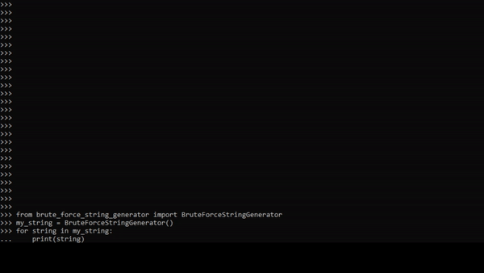

# BruteForceStringGenerator
Python class that generates string in bruteforce way

### Prerequisites
Python  >= 3.4

Development prerequisites

```
pipenv install
```

Production prerequisites

```
pipenv install --dev
```

To activate project's virtualenv run:
```
pipenv shell
```
## Running the tests

```
mypy brute_force_string_generator.py
pytest
```


### Examples:

```
>>gen = BruteForceStringGenerator()
>>next(gen)
>>'a'

>>gen = BruteForceStringGenerator(initial_sequence='aaaaaaaaaaaaaaaaaaaaaaaaaaaaaaaaaaaaaaaaaaaa')
>>next(gen)
>>'aaaaaaaaaaaaaaaaaaaaaaaaaaaaaaaaaaaaaaaaaaab'
```

### Class

```
sequence - starting string, default: ''
chars - pass custom letters, default: ascii_lowercase
direction - side to append letter to string: one of Direction.RIGHT, Direction.LEFT, default: Direction.RIGHT
min_length - initial length of string, default: 1
max_length - end length of string, default: 0 - nolimit
```                 
                 
                


